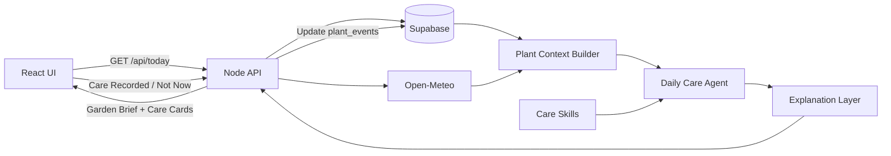
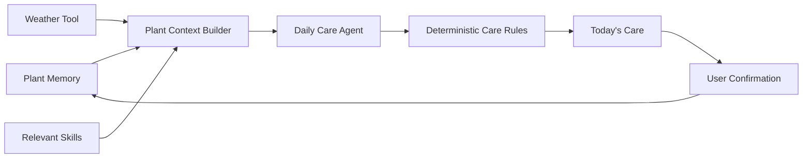

# GreenMate

GreenMate is a mobile-first plant care assistant for people who do not know what
their plants need each day. It combines each plant’s profile, care history, current
tasks, and local weather to produce one clear daily care recommendation per plant.
Users confirm or adjust the recommendation, and the result becomes part of that
plant’s long-term memory.

The core loop is:

`Observe → Recommend → Explain → Confirm or Adjust → Store as Plant Memory`

## Live Demo

Production: https://greenmate-demo.vercel.app


## Core features

- Daily Garden Brief with real local weather
- One prioritized Today’s Care recommendation per plant
- Recommendation completion, delay, and “Not Now” feedback
- Plant profiles, growing conditions, photos, and archive history
- Manual garden location or optional browser GPS
- Supabase-backed persistence and photo storage
- Repeatable five-plant Demo Garden seed

GreenMate’s AI value is in the care decision flow rather than a chatbot. The MVP
uses deterministic rules and evidence so recommendations are explainable and
testable. An LLM can later improve wording without becoming the sole decision maker.

GreenMate demonstrates agent-oriented architecture, reusable agent skills, external
tool integration, deterministic decision-making, and long-term plant memory in one
complete recommendation-to-action loop.

## Architecture

GreenMate separates UI, orchestration, care reasoning, and persistence:

- **React frontend** displays recommendations, gathers confirmation, manages local
  preferences, uploads photos, and reads plant archive views.
- **Node.js backend** exposes the care API, reads/writes Supabase, resolves weather,
  builds plant contexts, and invokes the agent.
- **Daily Care Agent** evaluates deterministic rules sourced from `skills/`, selects
  at most one recommendation per plant, and produces evidence-backed explanations.
- **Supabase** stores plant profiles, photos, pending care, completed care, and archive
  history. Supabase Storage holds plant images.





### Today’s Care flow

1. `backend/services/todayCareService.js` reads active plants, recent
   `plant_events`, existing tasks, and latest photo references from Supabase.
2. `backend/tools/weatherTool.js` resolves a manual place name or uses GPS
   coordinates, then normalizes Open-Meteo conditions. A configured default location is used if weather resolution fails.
3. `agent/buildPlantContext.js` creates one temporary `PlantContext` per plant.
4. `agent/careRules.js` applies skill-configured rules to profile, archive, and weather
   evidence. Expected rain can replace outdoor watering with “Skip watering today.”
5. `agent/dailyCareAgent.js` selects the highest-priority non-duplicate decision.
6. `agent/aiGardenerExplanation.js` converts the decision into beginner-friendly copy
   without changing the decision itself.
7. The backend persists pending recommendations in `plant_events` and returns the
   dashboard response. Completing or skipping care updates that same archive row.

### Location and weather flow

`greenmate.settings` in browser `localStorage` is the single preference source.
Manual locations are geocoded by Open-Meteo on the backend. GPS coordinates are sent
to the backend for weather and reverse-geocoded in the browser for a reusable city
label. Open-Meteo supplies current conditions and today’s precipitation total.

## Project structure

```text
GreenMate/
├── frontend/   React/Vite UI, browser Supabase client, settings and UI utilities
├── backend/    Node HTTP API, Supabase service layer, weather tool, demo seed
├── agent/      Context builder, care rules, decisions, explanations, tests
├── skills/     Versioned care knowledge and rule-adapter configuration
├── supabase/   Complete schema snapshot and incremental migrations
└── docs/       Internal architecture and agent-flow notes
```

`frontend/src/App.jsx` intentionally remains the MVP composition root and still
contains several pages and modals. Deployment-safe utilities are already extracted
under `frontend/src/lib/`. See [Frontend evolution](#frontend-evolution).

## Prerequisites

- Node.js 20 or newer
- npm
- A Supabase project
- Supabase CLI only if applying migrations from the command line

## Local setup

Replace `<repository-url>` with the repository URL supplied for the project:

```sh
git clone <repository-url> GreenMate
cd GreenMate
```

Install both npm workspaces from the repository root:

```sh
npm install --workspace @greenmate/frontend
npm install --workspace @greenmate/backend
```

Running `npm install` at the root is an equivalent shortcut because the repository
uses npm workspaces.

Create local environment files:

```sh
cp frontend/.env.example frontend/.env.local
cp backend/.env.example backend/.env.local
```

Configure Supabase as described below, then start development in two terminals.

Terminal 1 — backend:

```sh
npm run start --workspace @greenmate/backend
```

Terminal 2 — frontend:

```sh
npm run dev --workspace @greenmate/frontend
```

- Frontend: `http://localhost:5173`
- Backend API: `http://localhost:4173`
- Vite proxies frontend `/api` requests to port `4173`.

For a production-style local run, build the frontend and serve both UI and API from
the backend:

```sh
npm start
```

Then open `http://localhost:4173`.

## Supabase setup

The MVP requires:

- `plants` — plant profiles and growing conditions
- `plant_photos` — image URLs and future analysis fields
- `plant_events` — pending recommendations and completed Plant Memory
- public Storage bucket `plant-photos`

For a fresh project, run `supabase/schema.sql` in the Supabase SQL Editor. It is the
latest complete schema snapshot, including the storage bucket and MVP photo policies.

For an existing database created from an earlier GreenMate schema, apply only the
incremental files in `supabase/migrations/` in filename order. With a linked Supabase
CLI project:

```sh
supabase db push
```

Do not run both the full snapshot and historical migrations against the same fresh
database.

## Environment variables

### Frontend — `frontend/.env.local`

```dotenv
VITE_SUPABASE_URL=https://your-project.supabase.co
VITE_SUPABASE_ANON_KEY=your_supabase_anon_key
```

- `VITE_SUPABASE_URL` — required
- `VITE_SUPABASE_ANON_KEY` — required
- `VITE_API_BASE_URL` — optional; defaults to http://localhost:5173.

### Backend — `backend/.env.local`

```dotenv
SUPABASE_URL=https://your-project.supabase.co
SUPABASE_ANON_KEY=your_supabase_anon_key
PORT=4173
```

- `SUPABASE_URL` — required
- `SUPABASE_ANON_KEY` — required
- `PORT` — optional; defaults to `4173`

Open-Meteo and the browser reverse-geocoding endpoint do not require project API
keys. Never commit `.env` or `.env.local` files. Never place a Supabase
`service_role` key in the frontend.


### Demo Garden

After environment variables and schema are configured:

```sh
npm run seed:demo
```

The repeatable seed creates Cherry Tomato01, Avocado01, Lemon01, Swan River Daisy01,
and Indoor Fern plus realistic archive events. It removes and recreates only those
named Demo Garden plants; foreign-key cascades clear their owned photos/events. It
does not touch auth users or unrelated system data. Photos should be uploaded through
the UI rather than seeded with fake URLs.

### RLS note

The schema enables RLS and anon policies for `plant_photos` and its Storage bucket.
The MVP has no authentication, so access to `plants` and `plant_events` depends on the
target project’s current RLS configuration. Before public deployment, review and
document explicit policies for every operation the anon client performs. Do not solve
RLS issues by exposing a `service_role` key.

## Tests and production build

From the repository root:

```sh
npm test
npm run build
```

Current status: **32/32 tests pass**, and the Vite production build completes without
warnings. Tests cover context construction, deterministic decisions, weather and
fallback behavior, duplicate prevention, archive write-back, Supabase photo flows,
and settings persistence.

## Agent, skills, and external tools

- **Plant Context Builder** normalizes database fields, archive events, care dates,
  observations, existing tasks, weather, and future input placeholders.
- **Care Rules Adapter** loads structured MVP configuration from relevant markdown
  skills rather than duplicating a second frontend knowledge base.
- **Daily Care Agent** makes deterministic, evidence-driven decisions and enforces one
  highest-priority recommendation per plant.
- **Explanation Layer** presents rule evidence in calm beginner-friendly language.
- **Weather Tool** uses Open-Meteo for current conditions and daily precipitation,
  with timeout and fallback behavior.
- **Today Care Service** is the orchestration boundary between Supabase, weather,
  context building, the agent, and the frontend API contract.
- **Supabase** provides PostgreSQL persistence and Storage; `plant_events` closes the
  recommendation → action → memory feedback loop.

The `skills/` documents are runtime inputs where they contain an
`MVP Adapter Configuration` block. Product, UI, implementation, and review skill files
also guide development but are not all loaded at runtime.

## Deployment

## Deployment

GreenMate is deployed with a separated frontend/backend setup:

| Part | Platform | Purpose |
|---|---|---|
| Frontend | Vercel | Hosts the React/Vite web app |
| Backend | Render | Hosts the Node/Express API |
| Database | Supabase | Stores plant profiles, care records, and activity data |


### 1. Deploy the backend on Render

1. Create a new **Web Service** on Render.
2. Connect the GitHub repository.
3. Set the root directory to:

```text
backend
```

4. Use the backend start command:

```bash
npm install
npm start
```

or, if configured separately:

```bash
npm install
node server.js
```

5. Add the required Render environment variables:

```dotenv
SUPABASE_URL=your_supabase_url
SUPABASE_ANON_KEY=your_supabase_anon_key
PORT=4173
CORS_ALLOWED_ORIGINS=https://greenmate-demo.vercel.app
```

6. Deploy the service and keep the generated Render URL for the frontend API base URL.

### 2. Deploy the frontend on Vercel

1. Import the same GitHub repository into Vercel.
2. Select **Vite** as the application preset.
3. Set the root directory to:

```text
frontend
```

4. Use the following build settings:

```text
Install Command: npm install
Build Command: npm run build
Output Directory: dist
```

5. Add the required Vercel environment variables:

```dotenv
VITE_SUPABASE_URL=your_supabase_url
VITE_SUPABASE_ANON_KEY=your_supabase_anon_key
VITE_API_BASE_URL=your_render_backend_url
```

For the production demo, the API base URL points to the Render backend.

6. Deploy the frontend.

### 3. Configure production domain and CORS

The production frontend domain is:

```text
https://greenmate-demo.vercel.app
```

The backend CORS configuration must allow this frontend domain.  
If the Vercel domain changes, update the backend CORS allowlist and redeploy the Render service.

### Deployment flow

```text
Browser
  ↓
Vercel Frontend
  ↓
Render Backend API
  ↓
Supabase Database
```

## Security

- No project API keys or passwords are committed.
- `.env`, `.env.*`, and `.env.local` are ignored, except checked-in `.env.example`
  templates.
- The browser uses only the Supabase anon key.
- The backend also uses the anon key for the current unauthenticated MVP.
- A Supabase `service_role` key must never be added to frontend code or any `VITE_*`
  variable.
- GPS permission is optional; manual location remains available.

## Known limitations and future work

- `App.jsx` remains large by design to avoid a risky pre-deployment component rewrite.
- Future frontend work should split stable views into `pages/`, reusable UI into
  `components/`, orchestration into `hooks/`, and external access into `services/`.
- RLS policies for all public tables need stronger production documentation and an
  authentication-aware design when accounts are introduced.
- The backend still needs deployment routing/rewrite polish.
- The agent is deterministic and template-explained; a future LLM may improve
  explanations while rules and evidence remain authoritative.
- A future conversational assistant could explain care and archive history, but it
  should not replace the daily recommendation loop.
